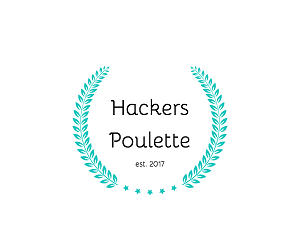

### hackers-poulette

**Creation d'un site nommé Hackers poulette**

[Liste des choses a faire](https://github.com/becodeorg/CRL-Woods-3.21/tree/master/LearningPath/03.The-Mountain/12.PHP/PHP-Challenges/hackers-poulette)

[Lien vers la version ONLINE](https://delvauxrobby.yj.fr/delvauxrobby.yj.fr/blog/Assets/hackers-poulette/)

1. Créer un Formulaire avec :
    1. Name & Lastname
    2. Gender 
    3. E-mail
    4. Country
    5. Subject (3 at least)
    6. Msg
    (Tous les champs doivent être remplis et le champ subject prend en defaut une autre valeur si pas remplis )
2. Un Mock-Up
3. Sémantique correct (HTML)
4. Accessibiliter aux aveugles 
5. En cas de mauvaise saisie, le formulaire doit afficher un indice visuel utile sur l'erreur
                        afficher le message d'erreur à proximité du champ de saisie correct.
6. Le message d'erreur doit être lisible (utile aux utilisateurs).
7. Le formulaire doit être nettoyé et validé (côté serveur).
8. Si toutes les entrées requises sont valides, le script doit répondre par e-mail à une adresse donnée
    mettre en œuvre une technique anti-spam honeypot.

*Optionnal*
* Validation côté client avec JavaScript
* Travailler sur une bonne et claire expérience utilisateur (UX)
* Répondre à la demande de l'utilisateur avec Ajax

# La mission 

Crée une page de contact pour l'équipe de support de Hackers poulette

# Quand ai je travailler dessus :

J'ai commencer le samedi 22 Aout 2020 a 11h avec un Bon café :D

# Ou j'en suis :

Je commence par le readme puis je vais faire me Mock up

# Qui suis je : 

[Robby Delvaux](https://github.com/Delvaux1986) 

